## **ci-cd-workshop**

## 📌 **Prerequisites**

Before starting this workshop, ensure you have:

* An active **AWS Account** with admin or equivalent permissions
* Basic understanding of:

  * Linux commands
  * Git & GitHub
  * CI/CD concepts (high-level is enough)
* AWS services familiarity (nice to have):

  * EC2
  * S3
  * IAM
  * DynamoDB
* A modern browser + stable internet
* Ability to use:

  * **AWS CloudShell**
  * **SSH** into EC2
  * **GitHub fork, clone, and push operations**

---

## 🎯 **Who This Guide Is For**

This hands-on CI/CD workshop is built for:

* Professionals exploring AWS CI/CD fundamentals
* DevOps beginners learning end-to-end CI/CD pipelines
* Students preparing for interviews or cloud practice
* Developers wanting to automate deployments
* Anyone who wants a **practical, working CI/CD pipeline** on AWS

No prior CI/CD experience is required — everything is step-by-step.

---

## 🌍 **Region & Execution Guidelines**

To avoid confusion and maintain consistency:

* **All AWS resources must be created in the region:**
  **US East (N. Virginia) — `us-east-1`**

Why?

* S3 static website hosting
* AMI availability
* DynamoDB consistency
* Keeping screenshots and instructions aligned
* Avoiding region mismatch issues during the workshop

If you accidentally create resources in another region, you may experience:

* S3 website not accessible
* EC2 AMI not found
* DynamoDB table not visible
* IAM roles misconfigured

So **ensure AWS Console is always set to `us-east-1`**.

---

## 🏗️ **Architecture Diagram — Architecture Overview**

This workshop implements a **3-tier architecture with CI/CD automation**:


### **Key Components**

* **Build Server (EC2):** Runs Jenkins and automates deployments
* **Frontend:** Hosted as a static site on **S3**
* **Backend:** Runs on a **separate EC2 server**
* **DynamoDB:** Stores assignment/submission data
* **GitHub:** Single source of truth for both frontend & backend code

You get a real, CI/CD workflow in a simplified, workshop-friendly environment.

---

## 🧪 **Hands-On Lab: CI/CD Workshop**

In this lab, you will build an end-to-end CI/CD pipeline:

### **You will create:**

* 1× **Build Server (EC2) running Jenkins**
* 1× **Backend Server (EC2)**
* 1× **Frontend S3 Static Website**
* 1× **DynamoDB Table**
* Required IAM roles, policies & permissions
* 1× **Backend Github Repo**
* 1× **Frontend Github Repo**

### **You will implement:**

* Jenkins pipeline for **frontend**
* Jenkins pipeline for **backend**
* Automated deployment into S3
* Automated SSH deployment to backend server
* GitHub → Jenkins webhook integration
* A working “Assignment Submission App” with live frontend → backend → DynamoDB flow

Everything is hands-on.
You will deploy actual code from the repo.

---

## 🚀 **Let’s Get Started!**

---

## **1. Access the Workshop Repository**

### 📖 Theory
<details> <summary>🔗 Why we need the repository</summary>
The workshop repository contains all pre-written code, configuration files, and instructions required to follow along.  
Accessing the repository ensures everyone uses the same version of files, avoiding inconsistencies and errors during the CI/CD setup.
</details>

To start the workshop, we first need to access the repository containing all the files and instructions.

### **Using Google Search (Recommended for Beginners)**

1. Open [Google](https://www.google.com).
2. Search for: **`rahul shivalkar github`**
3. Click on the GitHub profile shown in the results.
4. Go to the **Repositories** tab.
5. Click on the repository named **`ci-cd-workshop`**.

> 📌 **Why we do this:**
> This ensures you are always accessing the correct and latest repository, even if you don’t have the direct link. It also helps beginners practice finding resources on GitHub.

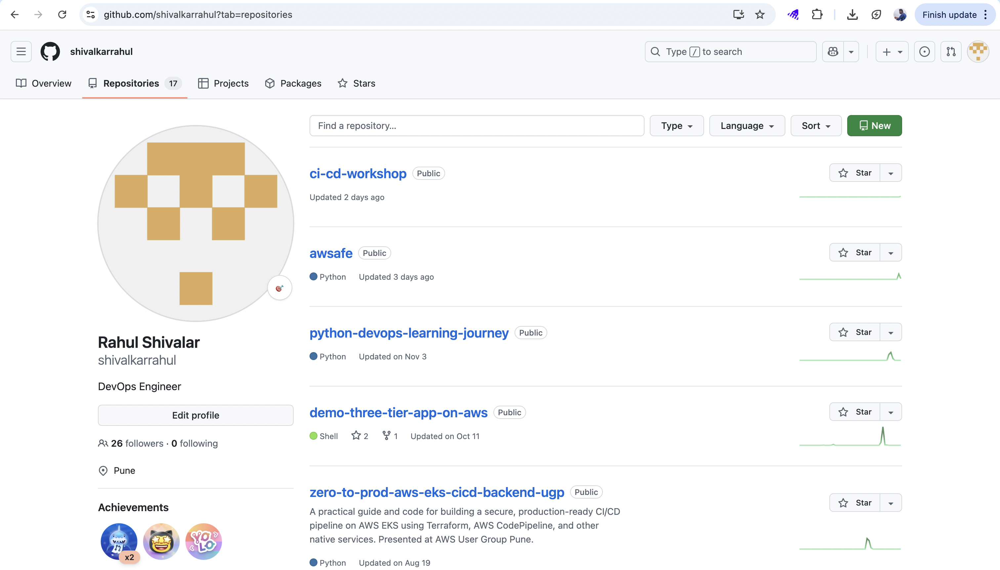

---

## **2. Create or Sign In to Your AWS Account**

### 📖 Theory

<details> <summary>☁️ Why We Need an AWS Account</summary>
AWS provides the cloud infrastructure required to run our CI/CD workshop application.  
With an AWS account, you can access essential services like:  

* **EC2** → to run backend and build servers
* **S3** → to host the frontend static website
* **DynamoDB** → to store application data

Having an account ensures you can create, manage, and deploy resources needed for all layers of the application.

</details>

### **Steps**

1. Open the AWS Console: **[https://aws.amazon.com/console/](https://aws.amazon.com/console/)**
2. If you **don’t have an account**, click **Create account** and follow the sign-up steps.
3. If you **already have an account**, click **Sign In** and enter your credentials.

> 💡 **Tip for Beginners:** Make sure you note down your account email and password, as you’ll need them throughout the workshop.

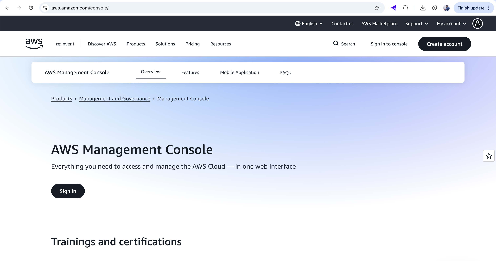

---

## **3. Create or Sign In to Your GitHub Account**

### 📖 Theory

<details> <summary>🐙 Why GitHub is Important</summary>
GitHub is a cloud-based platform for **version control** using Git.  

It allows you to:

* **Store your code** securely in repositories
* **Track changes** to your files over time
* **Collaborate** with others on the same project
* **Integrate with Jenkins** for automated CI/CD pipelines

Using GitHub ensures your workshop code is organized, safe, and ready for deployment.

</details>

### **Steps**

1. Open the GitHub website: **[https://github.com/](https://github.com/)**
2. If you **don’t have an account**, click **Sign up** and follow the instructions.
3. If you **already have an account**, click **Sign in** and enter your credentials.

> 💡 **Tip for Beginners:** Remember your GitHub username and password, as you’ll need them when configuring repositories and Jenkins pipelines.


---

## **4. Launch the Build Server (EC2 Instance)**

### 📖 Theory
<details> <summary>🖥️ Purpose of the Build Server</summary>
The build server (EC2 instance) acts as the CI/CD orchestrator.  
It runs Jenkins, pulls code from GitHub, and automates deployment for both frontend and backend components.  
Using a dedicated server keeps deployment consistent and separate from local machines.
</details>

We will create **one build server** in the **N. Virginia (us-east-1)** region.

### **4.1. Confirm AWS Region**

Ensure your AWS region is set to:

**US East (N. Virginia) — us-east-1**

### **4.2. Create the EC2 Instance**

1. In the AWS Console, search for **EC2** and open it.

2. Click **Instances** in the left-hand menu.

3. Click **Launch instance**.

4. Fill in the following configuration details:

   * **Name:** `ci-cd-workshop-build-server`

   * **AMI:** Ubuntu Server 24.04 LTS (HVM), SSD Volume Type

   * **Instance Type:** `t2.medium`

   * **Key Pair:**

     * Click **Create new key pair**
     * **Name:** `ci-cd-workshop`
     * **Type:** RSA
     * **File Format:** `.pem`
       *(We will use AWS CloudShell, which supports `.pem` files directly.)*
     * Click **Create key pair** to download the file.

   * **Network Settings:**

     * Select **Create security group**
     * Allow SSH (port 22) from **Anywhere (0.0.0.0/0)**
     * ⚠️ **This is NOT recommended for production.**
       For demo and workshop purposes, we are allowing open SSH access to avoid connection issues.

   * **Storage:**

     * Root volume size: **20 GB**

   * **Number of Instances:**

     * Set to **1**

5. Click **Launch instance**.

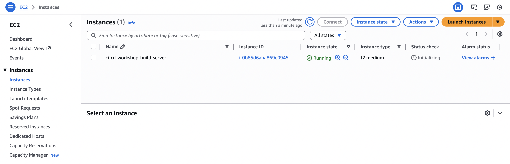


### **4.3. Create IAM Role for Build Server EC2**

### 📖 Theory
<details> <summary>🔑 IAM Role for Secure Access</summary>
An IAM role grants the EC2 build server the permissions it needs to interact with AWS resources.  
For this workshop, the role allows the build server to access S3 for frontend deployments.  
Roles eliminate the need to store credentials on the server itself.
</details>

To allow the backend to access S3 :

1. Go to **AWS Console → IAM**: [https://us-east-1.console.aws.amazon.com/iam/home?region=us-east-1#/home](https://us-east-1.console.aws.amazon.com/iam/home?region=us-east-1#/home)
2. Click **Roles** in the left-hand menu.
3. Click **Create role**
4. Choose **EC2** as the **Service or use case** →  Next

5. Search and Select the following policies to attach it to the role →  Next

   * `AmazonS3FullAccess`
6. Name the role: `ci-cd-workshop-build-server-role`
7. Click **Create role**

### **4.4. Attach the IAM Role to Build Server EC2 Instance**

### 📖 Theory
<details> <summary>🔗 Linking Role to EC2</summary>
Attaching the IAM role to the EC2 instance enables the server to assume the role and gain the permissions defined earlier.  
This is required for Jenkins pipelines to deploy the frontend to S3 without manually providing AWS credentials.
</details>


1. Go to **EC2 → Instances → Select ci-cd-workshop-build-server → Actions → Security → Modify IAM Role → Search and Select `ci-cd-workshop-build-server-role` → Click Update IAM role**


### **4.5. Connect to the Build Server (EC2 Instance)**

### 📖 Theory
<details> <summary>🔐 Secure Connection Methods</summary>
SSH allows secure remote access to the build server.  
Using AWS CloudShell simplifies the connection process, as it works directly from the browser and supports the `.pem` key.  
Once connected, you can run commands, install Jenkins, and manage deployments.
</details>


When launching the EC2 instance earlier, we downloaded a **.pem** key pair file.
This key is required to securely connect to the server.

There are multiple ways to connect to an EC2 instance:

* **Windows:** Use PuTTY
  → You would download a **.ppk** key (or convert `.pem` → `.ppk`)
* **Mac / Linux:** Use the Terminal (supports `.pem` directly)
* **AWS CloudShell:** Easiest method, works from the browser

For this workshop, **we will use AWS CloudShell** to keep things simple.

---

### **4.6. Open AWS CloudShell**

1. On the AWS Console header, click the **CloudShell icon**
   (located near the **top center** of the page, slightly right of the search box).

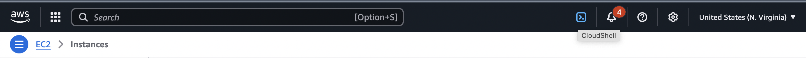

2. A terminal window will open at the bottom of your browser.
3. CloudShell will appear regardless of which AWS page you are on.

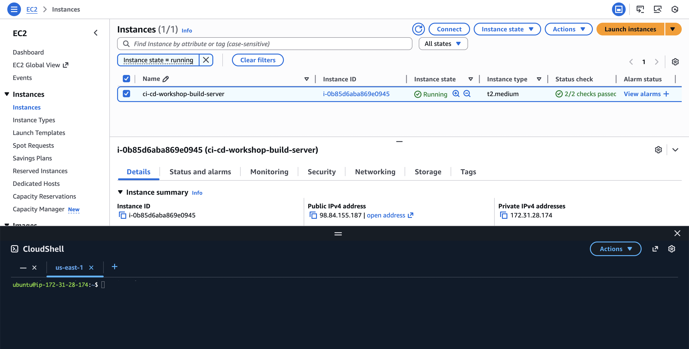


---

### **4.7. Upload Your .pem File**

1. In CloudShell, click **Actions → Upload file**
2. Select the key file you downloaded earlier:
   **`ci-cd-workshop.pem`**
3. Upload the file.

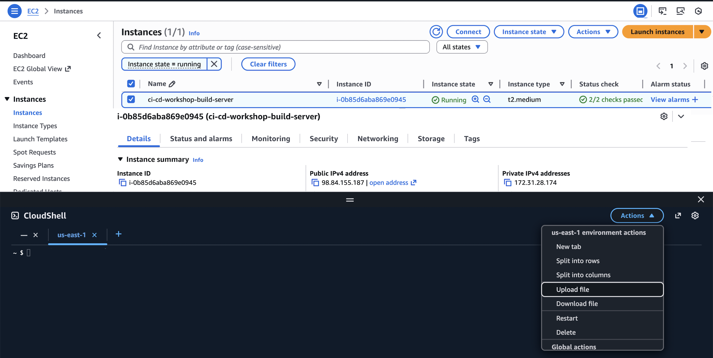

---

### **4.8. Set Correct File Permissions**

Run the following command in CloudShell:

```bash
chmod 400 ci-cd-workshop.pem
```

This sets secure permissions required by SSH.

---

### **4.9. Connect to the ci-cd-workshop-build-server EC2 Instance**

1. Open the **EC2 Console**
2. Select your instance **ci-cd-workshop-build-server**
3. Copy the **Public IPv4 address** from the **Details** tab

Now connect to your server:

```bash
ssh -i ci-cd-workshop.pem ubuntu@<PUBLIC-IP>
```

When asked:

```
Are you sure you want to continue connecting (yes/no/[fingerprint])?
```

Type:

```
yes
```

---

#### You are now inside the Build Server.

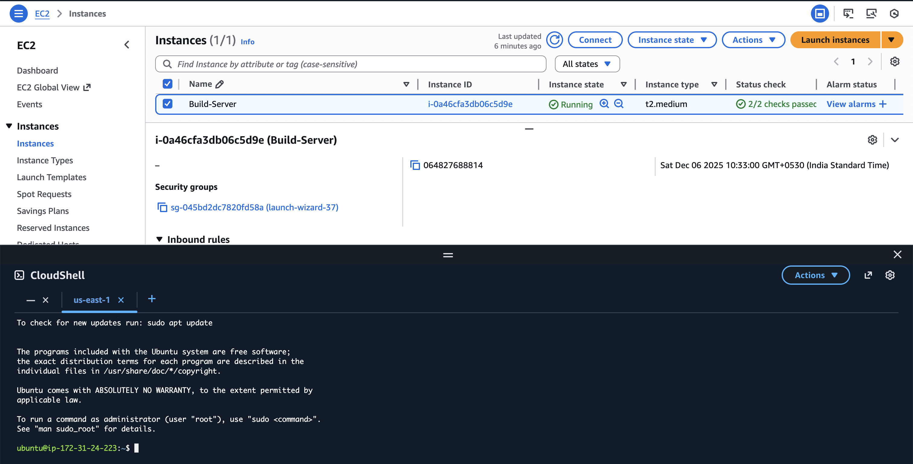

### **4.10. Install AWS CLI on Build Server**

#### 📖 Theory
<details> <summary>⚙️ Why AWS CLI is needed</summary>
The AWS CLI allows the build server to interact with AWS services like S3 and EC2 programmatically.  
It is essential for pipelines to automate deployments, create resources, and manage AWS infrastructure without manually using the console.
</details>

Run the following commands on the build server:

```bash
sudo apt update -y
```

```bash
sudo apt install unzip curl -y
```

```bash
curl "https://awscli.amazonaws.com/awscli-exe-linux-x86_64.zip" -o "awscliv2.zip"
```

```bash
unzip awscliv2.zip
```

```bash
sudo ./aws/install
```

```bash
aws --version
```

This confirms that the AWS CLI is installed.

Next, run the following command to verify that the **IAM role is correctly attached** to the EC2 instance:

```bash
aws sts get-caller-identity
```

If everything is configured properly, you will see output similar to:

```json
{
    "UserId": "ARO********FWTVQ:i-0b85*********e0945",
    "Account": "************",
    "Arn": "arn:aws:sts::************:assumed-role/ci-cd-workshop-build-server-role/i-0b85*********e0945"
}
```

This means:

* The EC2 instance is **successfully assuming the IAM role** (`ci-cd-workshop-build-server-role`).
* Jenkins pipelines running on this instance can now use AWS CLI commands.
* This enables automatic **frontend deployment to S3** and other AWS actions.

---

## **5. Install Jenkins on the Build Server (EC2 Instance)**

### 📖 Theory
<details> <summary>🧩 Jenkins for CI/CD</summary>
Jenkins is a continuous integration/continuous deployment (CI/CD) tool that automates building, testing, and deploying code.  
Installing it on the build server allows automated pipelines for both frontend and backend projects, triggered on GitHub commits.
</details>


Follow the steps below on your EC2 build server after connecting through CloudShell.

---

### **5.1. Install Java (Required by Jenkins)**

```bash
sudo apt update
```

```bash
sudo apt install openjdk-17-jdk -y
```

Verify:

```bash
java -version
```

---

### **5.2. Install Jenkins**

```bash
curl -fsSL https://pkg.jenkins.io/debian/jenkins.io-2023.key \
  | sudo tee /usr/share/keyrings/jenkins-keyring.asc > /dev/null
```

```bash
echo "deb [signed-by=/usr/share/keyrings/jenkins-keyring.asc] https://pkg.jenkins.io/debian binary/" \
  | sudo tee /etc/apt/sources.list.d/jenkins.list > /dev/null
```

```bash
sudo apt update
```

You should now see entries from **pkg.jenkins.io** in the output.

```bash
sudo apt install jenkins -y
```

Start Jenkins:

```bash
sudo systemctl start jenkins
```

Enable auto-start on boot:

```bash
sudo systemctl enable jenkins
```

Check status:

```bash
sudo systemctl status jenkins
```

You should see **active (running)**.
Press **q** to exit the status screen.

---

### **5.3. Configure Security Group for Jenkins**

Jenkins runs on **port 8080**, so we must allow inbound traffic to this port on the Build Server’s security group.

Follow these steps carefully:

1. Go to the **AWS Console**

2. Search for **EC2** and open it

3. In the left menu, click **Instances**

4. Select your instance named **ci-cd-workshop-build-server**

5. At the bottom panel, click on the **Security** tab

6. Under **Security groups**, click on the security group linked to your instance
   (Example: `sg-0123456789abcdef`)

7. Now you are on the **Security Group Details** page

8. Click the **Inbound rules** tab

9. Click on **Edit inbound rules**

10. Click **Add rule**

11. Enter the following:

    * **Type:** Custom TCP
    * **Port range:** `8080`
    * **Source:** `0.0.0.0/0` (Anywhere IPv4)

      > This is **NOT recommended for production**, but acceptable for this workshop/demo.

12. Click **Save rules**

Your Build Server is now accessible on port **8080**, which is required to open the Jenkins UI.

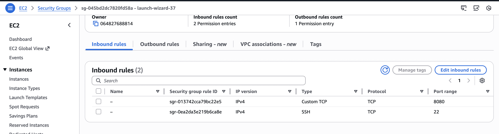

---

### **5.4. Access Jenkins UI and Complete Initial Setup**

#### 📖 Theory
<details> <summary>🔧 Configuring Jenkins</summary>
The initial setup configures Jenkins with suggested plugins, unlocks the admin account, and prepares it for pipelines.  
The SSH Agent Plugin allows Jenkins to securely connect to backend EC2 servers via SSH, enabling automated backend deployments.

The backend pipeline uses the sshagent step for SSH-based deployment.
To enable it, you must install the SSH Agent Plugin.
</details>

Open your browser and visit:

```
http://<public-ip>:8080
```

Replace `<public-ip>` with the public IP of the Build Server EC2 instance.


Run the following command in CloudShell (already connected to your EC2 instance):

```bash
sudo cat /var/lib/jenkins/secrets/initialAdminPassword
```

Copy the displayed password and paste it into the Jenkins unlock screen and cick on **Continue**.


After unlocking Jenkins, you will see the setup wizard. Follow these steps:

1. **Install Suggested Plugins**
   Jenkins will automatically begin installing the recommended plugins.
   (This may take a few minutes.)

2. On the next screen, when asked to create the first admin user:
   Click **“Skip and continue as admin”**
   (For the workshop, we do not need to create a new user.)

3. Jenkins will show the **Jenkins URL**.
   Do **not** change anything here.
   Simply click **Save and Finish**.

4. You will now see the confirmation message:
   **“Jenkins is ready!”**

5. Click **Start using Jenkins**

You will now be taken to the Jenkins dashboard.

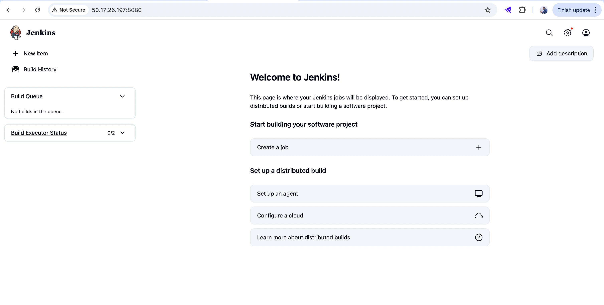

### **5.5. Install Required Plugin — SSH Agent Plugin**

The backend pipeline uses the `sshagent` step for SSH-based deployment.
To enable it, you must install the **SSH Agent Plugin**.

1. From the Jenkins dashboard → Click **Manage Jenkins**
   *(Gear icon at the top right, just before your profile icon)*
2. Click **Plugins**
3. Go to the **Available Plugins** tab
4. Search and Select:

```
SSH Agent
```

5. Click on **Install**

This plugin enables the `sshagent { ... }` syntax used in the backend Jenkinsfile.

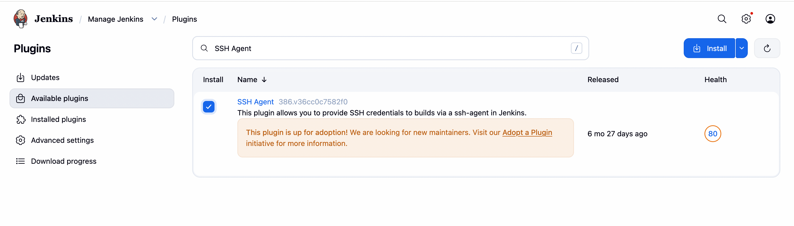

---

## **6. Create Infrastructure for 3-Tier App**

### 📖 Theory
<details> <summary>🏗️ Three-Tier Architecture</summary>
The workshop app uses a 3-tier architecture:

1. **Frontend (S3)** – Serves static website content.
2. **Backend (EC2)** – Hosts the Python Flask application.
3. **Database (DynamoDB)** – Stores assignments and submissions.

Separating these layers improves scalability, maintainability, and deployment automation.
</details>


Before we deploy our code, we need to create the **infrastructure** where the app will run. This includes:

1. **Frontend** → S3 bucket (static website)
2. **Backend** → EC2 instance (Flask app)
3. **Database** → DynamoDB table

Let’s create them step by step.

---

### **6.1. Create Frontend S3 Bucket (Static Website)**

1. Open the **AWS Console → S3**: [https://us-east-1.console.aws.amazon.com/s3/home?region=us-east-1](https://us-east-1.console.aws.amazon.com/s3/home?region=us-east-1) and click **Create bucket**.
2. Configure the bucket:

   * **Bucket name:** `ci-cd-workshop-frontend-<your-name>`
   * **Region:** same as your EC2 Build Server (e.g., **us-east-1**)
   * **Block all public access:** **Uncheck** and tick the acknowledgement checkbox

     > ⚠ Note: Not recommended for production, but fine for this demo. Bucket names must be globally unique — if taken, add some characters at the end.
   * Leave other options as default.
3. Click **Create bucket**.
4. Enable **Static website hosting**:

   * Open your bucket → **Properties → Static website hosting → Edit → Enable**
   * Index document: `index.html` → **Save changes**
   * Note the **Bucket website endpoint URL**.
5. Make the bucket publicly accessible:

   * Go to **Permissions → Bucket Policy → Edit**
   * Paste the following policy (replace `<your-bucket-name>`):

```json
{
  "Version": "2012-10-17",
  "Statement": [
    {
      "Sid": "PublicReadGetObject",
      "Effect": "Allow",
      "Principal": "*",
      "Action": "s3:GetObject",
      "Resource": "arn:aws:s3:::<your-bucket-name>/*"
    }
  ]
}
```

6. Click **Save changes**.

✅ Your frontend S3 bucket is ready to host the static website and is publicly accessible.

---

### **6.2. Create Backend EC2 Instance**

Our backend Flask app will run on an EC2 instance.

1. Go to **AWS Console → EC2**: [https://us-east-1.console.aws.amazon.com/ec2/home?region=us-east-1#Home:](https://us-east-1.console.aws.amazon.com/ec2/home?region=us-east-1#Home:)
2. Click **Launch instances**
3. Configure the instance:

   * **Name:** `ci-cd-workshop-backend-server`
   * **AMI:** Ubuntu Server 24.04 LTS (HVM), SSD Volume Type
   * **Instance type:** t2.medium
   * **Key pair:** Search and select an existing `ci-cd-workshop`

   * **Network Settings:**

     * Select **Create security group**
     * Allow SSH (port 22) from **Anywhere (0.0.0.0/0)**
     * ⚠️ **This is NOT recommended for production.**
       For demo and workshop purposes, we are allowing open SSH access to avoid connection issues.

   * **Storage:** 20 GB
   * **Number of instances:** 1
4. Click **Launch instance**
5. Once running, note the **public IP** — we will use this to connect to the backend.

### **6.3. Allow Python Port in Security Group**

Python runs on **port 5000**, so we must allow inbound traffic to this port on the Backend Server’s security group.

Follow these steps carefully:

1. Go to the **AWS Console**

2. Search for **EC2** and open it

3. In the left menu, click **Instances**

4. Select your instance named **ci-cd-workshop-backend-server**

5. At the bottom panel, click on the **Security** tab

6. Under **Security groups**, click on the security group linked to your instance
   (Example: `sg-0123456789abcdef`)

7. Now you are on the **Security Group Details** page

8. Click the **Inbound rules** tab

9. Click on **Edit inbound rules**

10. Click **Add rule**

11. Enter the following:

    * **Type:** Custom TCP
    * **Port range:** `5000`
    * **Source:** `0.0.0.0/0` (Anywhere IPv4)

      > This is **NOT recommended for production**, but acceptable for this workshop/demo.

12. Click **Save rules**

Your Backend Server is now accessible on port **5000**, which is required for the Frontend App to connect on the Backed App.


### **6.4. Connect to the ci-cd-workshop-backend-server EC2 Instance**

📌 Important:
Before connecting, ensure you're working from AWS CloudShell, not from the ci-cd-workshop-build-server EC2 instance.
If unsure, simply type **exit** to start a fresh CloudShell session.

1. Open the **EC2 Console**
2. Select your instance **ci-cd-workshop-backend-server**
3. Copy the **Public IPv4 address** from the **Details** tab

Now connect to your server:

```bash
ssh -i ci-cd-workshop.pem ubuntu@<PUBLIC-IP>
```

When asked:

```
Are you sure you want to continue connecting (yes/no/[fingerprint])?
```

Type and enter:

```
yes
```

---

#### You are now inside the Backend Server.

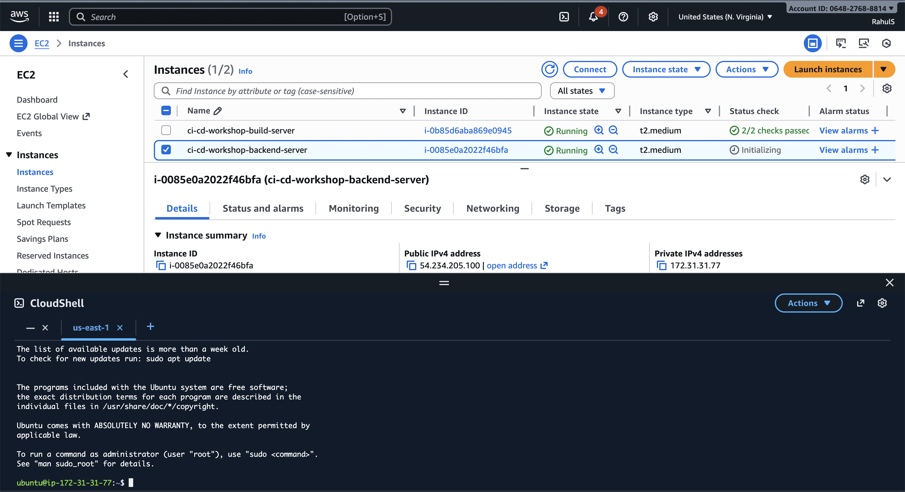

### ** 6.5. Install Python venv **

Run the following commands on the backend server:

```bash
sudo apt-get update
```

```bash
sudo apt install python3.12-venv
```

When asked:

```
Do you want to continue? [Y/n] Y
```

Type and enter:

```
yes
```


### **6.6. Create Database Layer (DynamoDB)**

We will create **two DynamoDB tables** to store all app data for the workshop:

1. **Assignments Table** – stores assignment metadata

   * **Table name:** `ci-cd-workshop-assignments`
   * **Primary key:** `assignment_id` (String)

2. **Submissions Table** – stores student submissions

   * **Table name:** `ci-cd-workshop-submissions`
   * **Primary key:** `submission_id` (String)

> ⚠ Note: DynamoDB table names must be unique in your account. If you already have a table with this name, add a short suffix like your initials (e.g., `ci-cd-workshop-assignments-rs`)

1. Open **AWS Console → DynamoDB**: [https://us-east-1.console.aws.amazon.com/dynamodbv2/home?region=us-east-1#dashboard](https://us-east-1.console.aws.amazon.com/dynamodbv2/home?region=us-east-1#dashboard)
2. Click **Create table** for the **Assignments Table**:

   * Enter **Table name:** `ci-cd-workshop-assignments`
   * Set **Partition key:** `assignment_id` (String)
   * Leave all other settings as default (on-demand capacity, encryption, etc.)
   * Click **Create table**
3. Repeat the process for the **Submissions Table**:

   * Enter **Table name:** `ci-cd-workshop-submissions`
   * Set **Partition key:** `submission_id` (String)
   * Leave all other settings as default → Click **Create table**

✅ Both tables are now ready to store **assignments** and **student submissions** for the workshop app.

---

### **6.7. Create IAM Role for ci-cd-workshop-backend-server EC2**

To allow the backend to access S3 and DynamoDB:


1. Go to **AWS Console → IAM**: [https://us-east-1.console.aws.amazon.com/iam/home?region=us-east-1#/home](https://us-east-1.console.aws.amazon.com/iam/home?region=us-east-1#/home)
2. Click **Roles** in the left-hand menu.
3. Click **Create role**
4. Choose **EC2** as the Service or use case →  Next

5. Search and Select the following policies to attach it to the role →  Next

   * `AmazonS3FullAccess`
   * `AmazonDynamoDBFullAccess`
6. Name the role: `ci-cd-workshop-backend-server-role`
7. Create role

### **5 Attach the IAM Role to EC2**
1. Go to **EC2 → Instances → Select ci-cd-workshop-backend-server → Actions → Security → Modify IAM Role → Search and Select `ci-cd-workshop-backend-server-role` → Click Update IAM role**


✅ All three tiers of our app are now ready!

---

## **7. Set Up GitHub Repositories and Push Workshop Files**

### 📖 Theory
<details> <summary>💾 Code Management and Versioning</summary>
Repositories provide a structured location for code and allow tracking changes over time.  
By cloning, committing, and pushing files from the build server, you ensure that Jenkins pipelines can pull the latest code for automated deployment.
</details>


In this step, we will **create GitHub repositories**, clone them on the **build server**, copy the prepared workshop files, commit, and push them to GitHub using a **Personal Access Token (PAT)**.

> ⚠️ All commands should be run **on the build server** using CloudShell

---

### **7.1. Create GitHub Repositories**

For this workshop, we will create **public** repositories so Jenkins can easily access them.
➡️ *In real organizations, repositories are usually **private** for security and compliance.*


1. Open your GitHub account: [https://github.com/](https://github.com/)
2. Click **New**.
3. Create **two repositories**:

   * `ci-cd-workshop-frontend`
   * `ci-cd-workshop-backend`
4. Leave all options default (Public, No README, No .gitignore, No license).
5. Click **Create repository**.

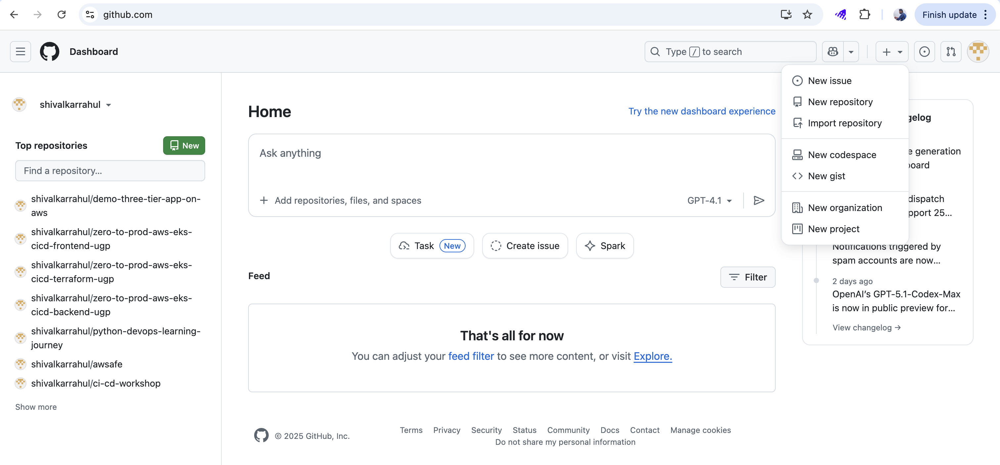 

---

### **7.2. Create GitHub Personal Access Token (PAT)**

1. Click your **Profile Picture in top-right corner  → Settings → Developer settings → Personal access tokens → Tokens (classic)**
2. Click **Generate new token → Generate new token (classic)**
3. Give a **note/name**: `ci-cd-workshop-token`
4. Select **expiration** (e.g., 90 days)
5. Under **Scopes**, select:

   * `repo` → Full control of private and public repositories
   * `workflow` → Optional for Jenkins triggers (future step)
6. Click **Generate token**
7. Copy the token somewhere safe, do not share with anyone. **You won’t be able to see it again**.

> We will use this token as the password when pushing commits from the build server.

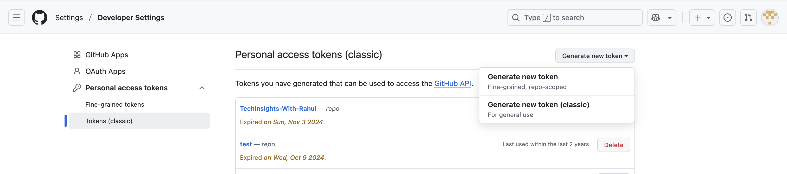

---

### **7.3. Connect to Build Server**

1. Open **CloudShell** from AWS Console:

Important: Before proceeding, remember:

The aim of the following steps is to clone your frontend and backend repositories, add the required workshop code and Jenkinsfiles that are provided in this main repository, and push them back to your GitHub repos.

You can perform these steps from any machine, including your laptop. We use the build server here only for convenience.

```bash
ssh -i ci-cd-workshop.pem ubuntu@<BUILD-SERVER-PUBLIC-IP>
```

2. Navigate to a working directory:

```bash
mkdir ~/ci-cd-workshop
```

```bash
cd ~/ci-cd-workshop
```

---

### **7.4. Configure Git (First Time Only)**

Replace **`<Your Name>`** and **`<your-email@example.com>`** with your actual details:

```bash
git config --global user.name "<Your Name>"
```

```bash
git config --global user.email "<your-email@example.com>"
```

---

### **7.5. Clone the Repositories Using HTTPS**

Replace `<your-username>` with your GitHub username:

```bash
# Frontend
git clone https://github.com/<your-username>/ci-cd-workshop-frontend.git
```

```bash
# Backend
git clone https://github.com/<your-username>/ci-cd-workshop-backend.git
```

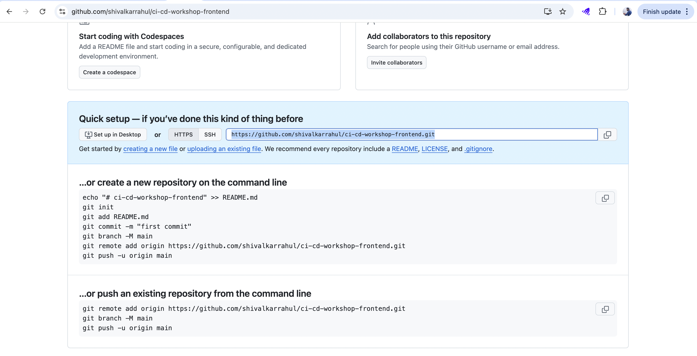

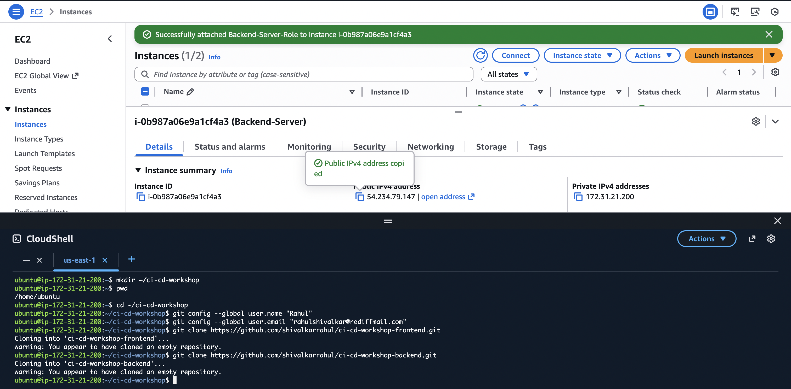


---

### **7.6. Download and Copy Workshop Files**

In this step, you will download the required frontend and backend application files into your GitHub repositories.
These files are already prepared in the main workshop repo and need to be copied into your cloned frontend/backed repos so that Jenkins can build and deploy them.

#### **Frontend Files**

Navigate to your frontend repo:

```bash
cd ~/ci-cd-workshop/ci-cd-workshop-frontend
```

Below are the files you will download and why each is needed:

#### **1. `index.html` — The Frontend Application**

This is the main UI of the Assignment Tracker application.
It contains:

* The HTML layout
* JavaScript functions to call the backend API
* Logic to display Assignment lists and versions

Download:

```bash
wget https://raw.githubusercontent.com/shivalkarrahul/ci-cd-workshop/main/frontend/index.html
```

#### **2. `frontend_version.json` — Frontend Version Tracking**

This file contains a simple JSON with a version number.
It helps verify whether the frontend deployment updated successfully in S3.

Download:

```bash
wget https://raw.githubusercontent.com/shivalkarrahul/ci-cd-workshop/main/frontend/frontend_version.json
```

#### **3. `Jenkinsfile` — CI/CD Pipeline for Frontend**

This Jenkinsfile defines:

* How the frontend should be built
* How files are uploaded to S3
* Which S3 bucket to deploy to
* Pipeline stages and parameters

Download:

```bash
wget https://raw.githubusercontent.com/shivalkarrahul/ci-cd-workshop/main/frontend/Jenkinsfile
```

#### **Backend Files**

Navigate to your backend repo:

```bash
cd ~/ci-cd-workshop/ci-cd-workshop-backend
```

Below are the backend files and their purpose:

#### **1. `app.py` — Backend Flask Application**

This is the core Python backend service.
It provides:

* API endpoints for assignments
* Logic to submit, list, and create assignments
* Version info endpoint

Download:

```bash
wget https://raw.githubusercontent.com/shivalkarrahul/ci-cd-workshop/main/backend/app.py
```

#### **2. `backend_version.txt` — Backend Version Tracking**

This file stores the backend version.
It helps confirm if the backend deployment on EC2 updated successfully.

Download:

```bash
wget https://raw.githubusercontent.com/shivalkarrahul/ci-cd-workshop/main/backend/backend_version.txt
```

#### **3. `requirements.txt` — Python Dependencies**

This file lists all Python libraries required for the backend, such as Flask.
Jenkins installs these packages on the server using this file.

Download:

```bash
wget https://raw.githubusercontent.com/shivalkarrahul/ci-cd-workshop/main/backend/requirements.txt
```

#### **4. `Jenkinsfile` — CI/CD Pipeline for Backend**

This Jenkinsfile defines the backend continuous delivery process including:

* Connecting to backend EC2 via SSH
* Installing dependencies
* Restarting the Flask app
* Passing server IP as a parameter

Download:

```bash
wget https://raw.githubusercontent.com/shivalkarrahul/ci-cd-workshop/main/backend/Jenkinsfile
```

---

### **7.7. Commit and Push Changes**

#### **Frontend Repo**

```bash
cd ~/ci-cd-workshop/ci-cd-workshop-frontend
```

```bash
ls -l
```

```bash
git status
```

```bash
git add .
```

```bash
git status
```

```bash
git commit -m "Initial commit: workshop frontend files"
```

```bash
git push origin main
```

> During `git push`, Git will prompt for credentials:
>
> * **Username:** GitHub username
> * **Password:** Personal Access Token (PAT) created earlier

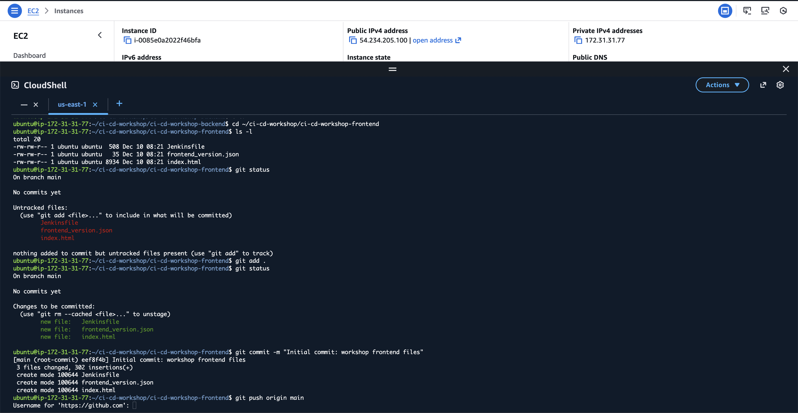

#### **Backend Repo**

```bash
cd ~/ci-cd-workshop/ci-cd-workshop-backend
```

```bash
ls -l
```

```bash
git status
```

```bash
git add .
```

```bash
git status
```

```bash
git commit -m "Initial commit: workshop backend files"
```

```bash
git push origin main
```

> During `git push`, Git will prompt for credentials:
>
> * **Username:** GitHub username
> * **Password:** Personal Access Token (PAT) created earlier

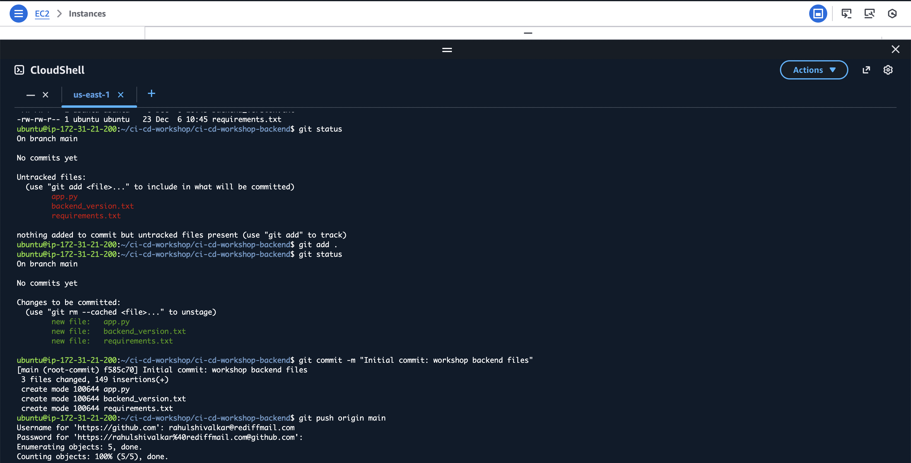

---

### **7.8. Verify on GitHub**

1. Open the repositories in your GitHub account:

   * `https://github.com/<your-username>/ci-cd-workshop-frontend`
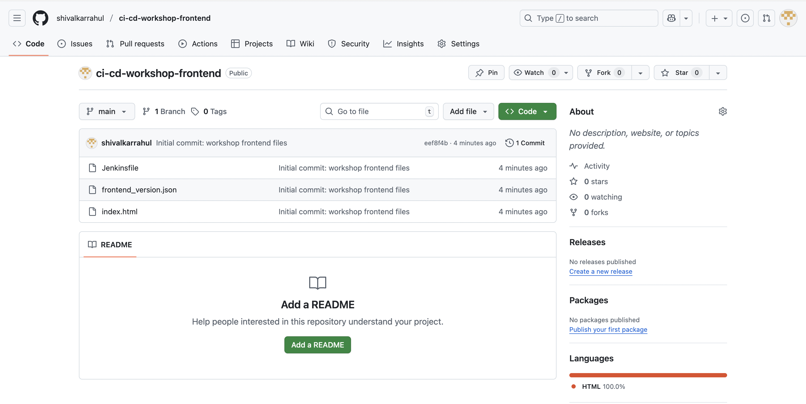

   * `https://github.com/<your-username>/ci-cd-workshop-backend`
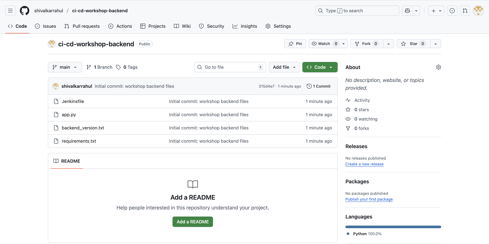

2. You should see all your files and initial commits.

✅ **Congratulations!** Your workshop files are now versioned in GitHub and ready for Jenkins CI/CD pipelines.

---

## **8. Configure Jenkins Pipelines & Deployment (CI/CD Automation)**

### 📖 Theory
<details> <summary>🚀 Automating Deployment</summary>
Jenkins pipelines automate the deployment of frontend and backend code:

- **Frontend:** Deployed to S3 bucket.
- **Backend:** Deployed to EC2 via SSH.

GitHub webhooks trigger pipelines on every push, ensuring the application is always up-to-date without manual intervention.
</details>


In this step, we will **configure Jenkins** to automatically deploy the **frontend** to S3 and the **backend** to the backend EC2 server whenever code is pushed to GitHub. We will also store the existing EC2 key pair in Jenkins for secure SSH access.

> ⚠️ All commands and steps are performed on the **build server** via CloudShell or SSH.

---

### **8.1. Store SSH Key in Jenkins**

We will use the **existing EC2 key pair** `ci-cd-workshop.pem` for backend deployment.

### **Open Your Jenkins Dashboard**


1. Open your **Jenkins Dashboard** in browser:

Open the Jenkins dashboard in your browser using the public IP of your Jenkins server.

   ```
   http://<build-server-public-ip>:8080
   ```

If you are logged out, sign back in using:

* **Username:** `admin`
* **Password:** The Jenkins initial admin password you retrieved earlier using the following command on **ci-cd-workshop-build-server**:

  ```bash
  sudo cat /var/lib/jenkins/secrets/initialAdminPassword
  ```

2. Go to **Manage Jenkins(Gear Icon in right top corner) → Credentials → System → Global credentials → Add Credentials**.
3. Open `ci-cd-workshop.pem` in notepad/textpad on your local machine and copy the content
4. Select:

   * **Kind:** SSH Username with private key
   * **Scope:** Global
   * **ID:** `backend-server-ssh`
   * **Description:** SSH Key for backend-server deployment
   * **Username:** `ubuntu`
   * **Private Key:** Enter directly → paste the content of `ci-cd-workshop.pem` you copied
   
5. Click **Create**.

✅ Jenkins now has the SSH key to connect to the backend server.

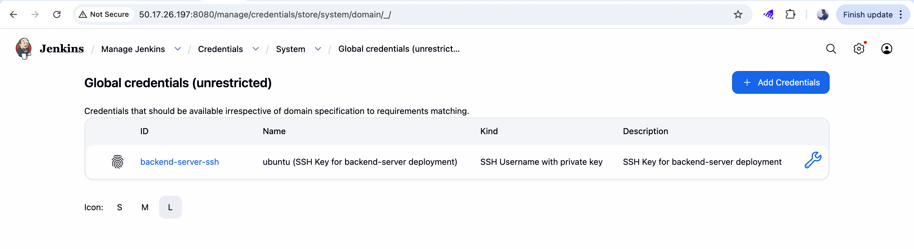

---

### **8.2. Create Jenkins Pipeline for Frontend**

We will create a **frontend pipeline** that deploys the static site to S3 using a **parameterized bucket name**.

1. In Jenkins Dashboard → **New Item**.
2. Enter **Item Name:** `frontend-deploy`
3. Select **Pipeline** → Click **OK**.
4. General → Tick **GitHub project**, Checkbox and add Frontend Repo URL in Project url.
5. Triggers → Tick **GitHub hook trigger for GITScm polling** Checkbox
6. Scroll to **Pipeline section → Definition:** `Pipeline script from SCM`.
7. Select **Git** → Repository URL:

   ```
   https://github.com/<your-username>/ci-cd-workshop-frontend.git
   ```
8. Branch: `main`
9. Script Path: `Jenkinsfile`
10. Save the pipeline.

> **Note:** The frontend `Jenkinsfile` should use a parameter for bucket name, so when triggered via webhook, it automatically deploys to the correct S3 bucket without prompting.

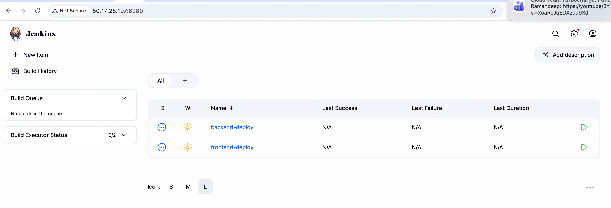

---

### **8.3. Create Jenkins Pipeline for Backend**

We will create a **backend pipeline** that deploys the Python Flask app to the backend EC2 server using SSH.

1. In Jenkins Dashboard → **New Item**.
2. Enter **Item Name:** `backend-deploy`
3. Select **Pipeline** → Click **OK**.
4. General → Tick **GitHub project**, Checkbox and add Backend Repo URL in Project url.
5. Triggers → Tick **GitHub hook trigger for GITScm polling** Checkbox
6. Scroll to **Pipeline section → Definition:** `Pipeline script from SCM`.
7. Select **Git** → Repository URL:

   ```
   https://github.com/<your-username>/ci-cd-workshop-backend.git
   ```
8. Branch: `main`
9. Script Path: `Jenkinsfile`
10. Save the pipeline.

> **Note:** Backend `Jenkinsfile` uses the stored SSH key (`backend-server-ssh`) to connect to backend EC2, setup virtual environment, install requirements, stop old process, and start Flask app.


---

### **8.4. Configure GitHub Webhooks**

We will make Jenkins automatically trigger pipelines on **GitHub push**.

Repeat this for both the repos

1. Open **GitHub → Repository → Settings → Webhooks → Add webhook**.
2. Enter:

   * **Payload URL:**

     ```
     http://<build-server-public-ip>:8080/github-webhook/
     ```
   * **Content type:** `application/json`
   * **Secret:** leave blank (optional)
   * **Which events would you like to trigger this webhook?** → **Just the push event**
3. Click **Add webhook**.

✅ Whenever you push code to the repo, Jenkins will automatically trigger the pipeline.

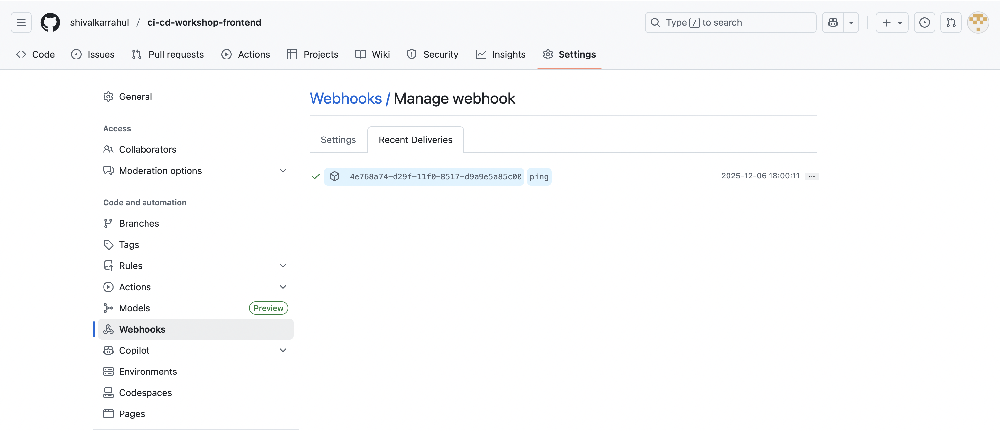
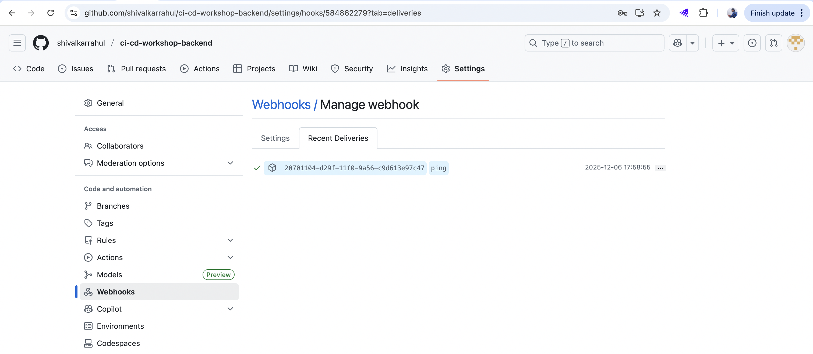

---

### **8.5. Test Frontend Pipeline**

The purpose of the following steps is to make small changes to your **frontend** and **backend** repositories, commit them, and push them to GitHub.

You can perform these changes from **any machine** (your laptop, CloudShell, or build server).
Here we use the **build server** only for convenience.


#### **8.5.1. Modify the Frontend Repository**

Navigate to the frontend directory:

```bash
cd ~/ci-cd-workshop/ci-cd-workshop-frontend
```

**Update `frontend_version.json`**

```bash
vim frontend_version.json
```

* Press **i** → edit the version
* Press **Esc**, type **:wq!**, press **Enter**

**Update `Jenkinsfile`**

```bash
vim Jenkinsfile
```

Find the parameter:

```
ci-cd-workshop-frontend-<your-name>
```

Replace it with **your actual S3 bucket name**.

* Press **i** → edit the version
* Press **Esc**, type **:wq!**, press **Enter**

**Update `index.html`**

Edit using:

```bash
vim index.html
```

Look for:

```js
const API_BASE = "http://127.0.0.1:5000";
```

Replace with:

```js
const API_BASE = "http://<your-backend-server-public-ip>:5000";
```

* Press **i** → edit the version
* Press **Esc**, type **:wq!**, press **Enter**

#### **8.5.2. Commit and Push the Frontend Changes**

```bash
git status
```

```bash
git add .
```

```bash
git commit -m "Test frontend update"
```

```bash
git push origin main
```

> During `git push`, Git will prompt for credentials:
>
> * **Username:** GitHub username
> * **Password:** Personal Access Token (PAT) created earlier

#### **8.5.3. Verify the Frontend Pipeline**

1. Open Jenkins → **frontend-deploy pipeline** → check **Builds**.
2. If successful, Jenkins will upload your updated frontend to S3.

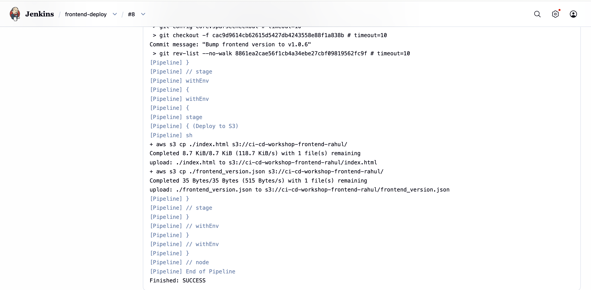

#### **8.5.4. Validate the Deployed Frontend**

1. Go to **S3 → Your Bucket → Properties**
2. Open **Static Website Hosting**
3. Click the **Bucket Website Endpoint** URL

If the app loads and shows:
**“Frontend Version: <your version>”**,
the deployment is successful.

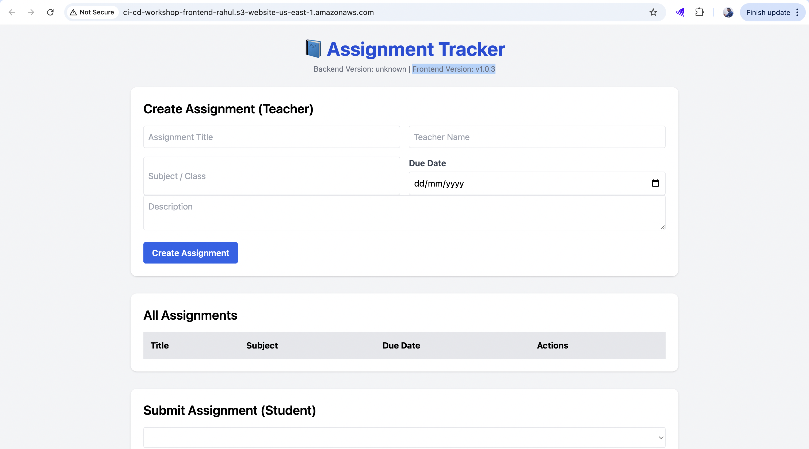

---

### **8.6. Test Backend Pipeline**

#### **8.6.1. Modify the Backend Repository**

Navigate to the backend directory:

```bash
cd ~/ci-cd-workshop/ci-cd-workshop-backend
```

**Update `backend_version.txt`**

```bash
vim backend_version.txt
```
* Press **i** → edit the version
* Press **Esc**, type **:wq!**, press **Enter**

**Update `Jenkinsfile`**

Open

```bash
vim Jenkinsfile
```

Update the parameter:

```
<backend-server-ip>
```

Replace with your backend EC2 **public IP address**.

* Press **i** → edit the version
* Press **Esc**, type **:wq!**, press **Enter**

#### **8.6.2. Commit and Push the Backend Changes**

```bash
git status
```

```bash
git add .
```

```bash
git commit -m "Test backend update"
```

```bash
git push origin main
```

> During `git push`, Git will prompt for credentials:
>
> * **Username:** GitHub username
> * **Password:** Personal Access Token (PAT) created earlier

#### **8.6.3. Verify the Backend Pipeline**

Open Jenkins → **backend-deploy** → verify the latest execution.

This should:

* Connect over SSH
* Install dependencies
* Restart the backend server
* Run your updated backend API

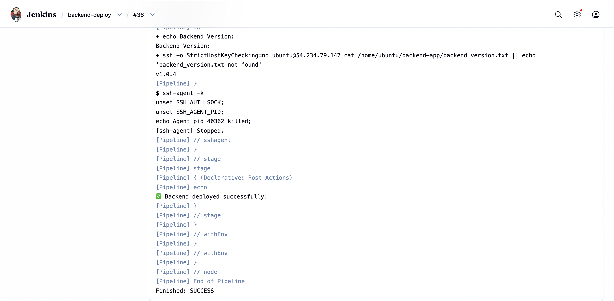

#### **8.6.4. Validate Backend Deployment**

Open your S3 hosted frontend website again.

If you see:

**“Backend Version: <your version>”**,
and API calls work (Create, Submit, List Assignments),
your backend deployment is successful.

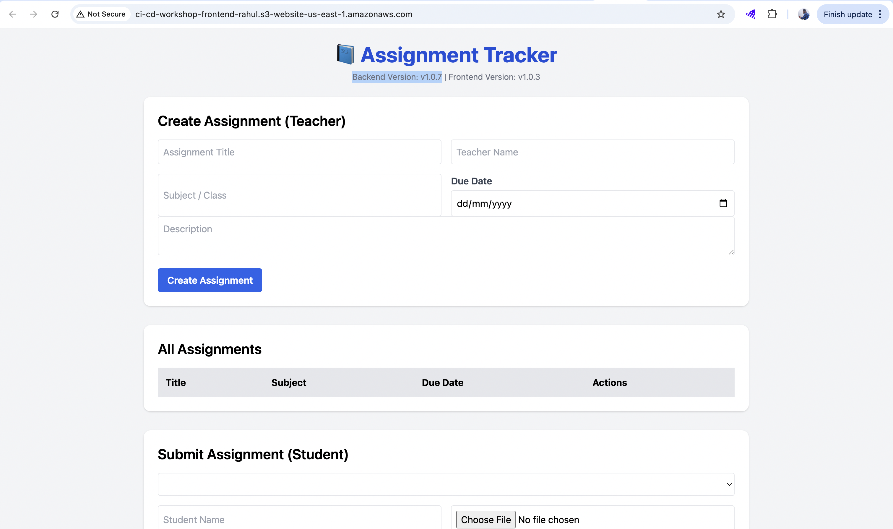

### 🏆 **Congratulations — CI/CD Fully Working!**

You now have:

✅ Automated **frontend CI/CD**
— GitHub → Jenkins → S3 → Static Website Hosting

✅ Automated **backend CI/CD**
— GitHub → Jenkins → SSH → EC2 Deployment

✅ GitHub Webhooks triggering pipelines on every push

Your environment is now running a **complete CI/CD pipeline** for a live full-stack application.

---

## **9. Cleanup**

### 📖 Theory
<details> <summary>🧹 Cleaning Up Resources</summary>
The cleanup script removes all workshop resources: EC2 instances, S3 buckets, DynamoDB tables, IAM roles, and security groups.  
This ensures no lingering costs or unnecessary AWS resources after the workshop.
</details>


### **Before You Continue — Important Note**

You can **delete all resources manually from the AWS Console** (EC2, S3, IAM, DynamoDB, Security Groups, Key Pairs, etc.).
That approach is completely valid.

However, manual deletion is:

* slow
* error-prone
* easy to miss resources
* painful if you created many items

So the script below is provided **only to save your time** and ensure everything is deleted cleanly.

Now, go to AWS Console → Click CloudShell icon (top right)
Then run the commands below.

### 🚀 **9.1 Export Variables**

```bash
REGION="us-east-1"

# Build server
BUILD_SERVER_NAME="ci-cd-workshop-build-server"
BUILD_SERVER_ROLE="ci-cd-workshop-build-server-role"
BUILD_KEY_PAIR="ci-cd-workshop"

# Frontend S3 bucket
FRONTEND_BUCKET="ci-cd-workshop-frontend-<your-name>"

# Backend server
BACKEND_SERVER_NAME="ci-cd-workshop-backend-server"
BACKEND_SERVER_ROLE="ci-cd-workshop-backend-server-role"

# DynamoDB tables
DDB_ASSIGN_TABLE="ci-cd-workshop-assignments"
DDB_SUBMIT_TABLE="ci-cd-workshop-submissions"

# Build server
BUILD_INSTANCE_PROFILE="ci-cd-workshop-build-server-role"

# Backend server
BACKEND_INSTANCE_PROFILE="ci-cd-workshop-backend-server-role"

# Disable AWS pager
export AWS_PAGER=""
```

---

### **9.2. Delete EC2 Instances (Build + Backend)**

#### 🔍 **9.2.1. Get Instance IDs**

```bash
BUILD_INSTANCE_ID=$(aws ec2 describe-instances \
    --filters "Name=tag:Name,Values=$BUILD_SERVER_NAME" \
    --query "Reservations[].Instances[].InstanceId" \
    --output text \
    --region $REGION \
    --no-cli-pager)

echo "Build Server Instance: $BUILD_INSTANCE_ID"

BACKEND_INSTANCE_ID=$(aws ec2 describe-instances \
    --filters "Name=tag:Name,Values=$BACKEND_SERVER_NAME" \
    --query "Reservations[].Instances[].InstanceId" \
    --output text \
    --region $REGION \
    --no-cli-pager)

echo "Backend Server Instance: $BACKEND_INSTANCE_ID"
```

---

#### **9.2.2. Get Security Groups from Instances**

```bash
BUILD_SG_IDS=$(aws ec2 describe-instances \
    --instance-ids $BUILD_INSTANCE_ID \
    --query "Reservations[].Instances[].SecurityGroups[].GroupId" \
    --output text \
    --region $REGION \
    --no-cli-pager)

echo "Build Server SGs: $BUILD_SG_IDS"

BACKEND_SG_IDS=$(aws ec2 describe-instances \
    --instance-ids $BACKEND_INSTANCE_ID \
    --query "Reservations[].Instances[].SecurityGroups[].GroupId" \
    --output text \
    --region $REGION \
    --no-cli-pager)

echo "Backend Server SGs: $BACKEND_SG_IDS"
```

---

#### **9.2.3. Terminate Instances**

```bash
aws ec2 terminate-instances \
    --instance-ids $BUILD_INSTANCE_ID $BACKEND_INSTANCE_ID \
    --region $REGION \
    --no-cli-pager
```

```bash
aws ec2 wait instance-terminated \
    --instance-ids $BUILD_INSTANCE_ID $BACKEND_INSTANCE_ID \
    --region $REGION \
    --no-cli-pager
```

---

#### 🧹 **9.2.4. Delete Security Groups**

```bash
for sg in $BUILD_SG_IDS $BACKEND_SG_IDS; do
  echo "Deleting SG: $sg"
  aws ec2 delete-security-group \
      --group-id "$sg" \
      --region $REGION \
      --no-cli-pager
done
```

---

#### **9.2.5. Delete Key Pair**

```bash
aws ec2 delete-key-pair \
    --key-name "$BUILD_KEY_PAIR" \
    --region $REGION \
    --no-cli-pager
```

---

## **9.3. Empty & Delete Frontend S3 Bucket**

```bash
aws s3 rm s3://$FRONTEND_BUCKET --recursive --no-cli-pager

aws s3 rb s3://$FRONTEND_BUCKET --force --no-cli-pager
```

---

## **9.4. Delete DynamoDB Tables**

```bash
aws dynamodb delete-table \
    --table-name $DDB_ASSIGN_TABLE \
    --region $REGION \
    --no-cli-pager

aws dynamodb delete-table \
    --table-name $DDB_SUBMIT_TABLE \
    --region $REGION \
    --no-cli-pager
```
---

## **9.5. Delete Backend Role**

### **9.5.1. List attached managed policies**

```bash
aws iam list-attached-role-policies \
    --role-name $BACKEND_SERVER_ROLE \
    --no-cli-pager
```

### **9.5.2. Detach each policy (run for each ARN shown above)**

For example:

```bash
aws iam detach-role-policy \
    --role-name $BACKEND_SERVER_ROLE \
    --policy-arn arn:aws:iam::aws:policy/AmazonS3FullAccess \
    --no-cli-pager

aws iam detach-role-policy \
    --role-name $BACKEND_SERVER_ROLE \
    --policy-arn arn:aws:iam::aws:policy/AmazonDynamoDBFullAccess \
    --no-cli-pager
```

*(These two are the only policies you attached.)*

### **9.5.3. Remove role from instance profile**

```bash
aws iam remove-role-from-instance-profile \
    --instance-profile-name $BACKEND_INSTANCE_PROFILE \
    --role-name $BACKEND_SERVER_ROLE \
    --no-cli-pager
```

### **9.5.4. Delete instance profile**

```bash
aws iam delete-instance-profile \
    --instance-profile-name $BACKEND_INSTANCE_PROFILE \
    --no-cli-pager
```

### **9.5.5. Delete the role**

```bash
aws iam delete-role \
    --role-name $BACKEND_SERVER_ROLE \
    --no-cli-pager
```

---

## **9.6. Delete Build Server Role**

### **9.6.1. List attached managed policies**

```bash
aws iam list-attached-role-policies \
    --role-name $BUILD_SERVER_ROLE \
    --no-cli-pager
```

### **9.6.2. Detach policy**

```bash
aws iam detach-role-policy \
    --role-name $BUILD_SERVER_ROLE \
    --policy-arn arn:aws:iam::aws:policy/AmazonS3FullAccess \
    --no-cli-pager
```

### **9.6.3. Remove role from instance profile**

```bash
aws iam remove-role-from-instance-profile \
    --instance-profile-name $BUILD_INSTANCE_PROFILE \
    --role-name $BUILD_SERVER_ROLE \
    --no-cli-pager    
```

### **9.6.4. Delete instance profile**

```bash
aws iam delete-instance-profile \
    --instance-profile-name $BUILD_INSTANCE_PROFILE \
    --no-cli-pager
```

### **9.6.5. Delete role**

```bash
aws iam delete-role \
    --role-name $BUILD_SERVER_ROLE \
    --no-cli-pager
```

Here’s a clean, ready-to-add section explaining how to delete GitHub repositories from the GitHub console:

---

## **9.7. Delete GitHub Repositories**

As you created the **frontend** and **backend** repositories only for this workshop, you can delete them from the **GitHub Console** if you want.

#### **Steps to Delete a GitHub Repository**

1. Open GitHub and go to the repository you want to delete
   (e.g., `ci-cd-workshop-frontend` or `ci-cd-workshop-backend`).

2. Click **Settings** (top menu of the repository).

3. Scroll to the very bottom to the **Danger Zone** section.

4. Click **Delete this repository**.

5. GitHub will ask you to type the repository name for confirmation
   (example: `<user-name>/ci-cd-workshop-frontend`).

6. Click **I understand the consequences, delete this repository**.

You can repeat the same steps for both **frontend** and **backend** repos if you no longer need them.
